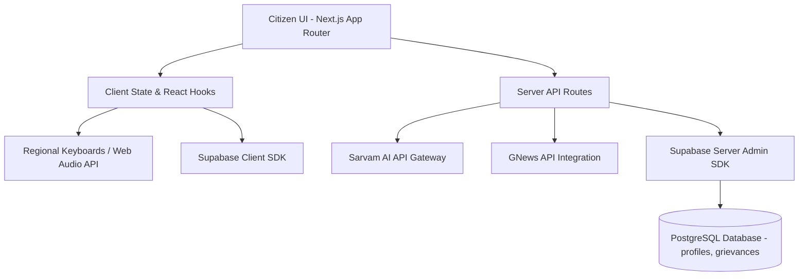

# 🇮🇳 Nagrik Mitra: One Assistant for Every Citizen
**Nagrik Mitra** (meaning *Citizen's Friend* in Hindi) is a unified citizen-engagement and digital-governance assistant platform. The platform is designed to bridge the digital and linguistic gap between regional citizens and digital government welfare structures. 

Nagrik Mitra empowers individuals to conversationalize profile building, verify scheme eligibility, construct formal civic complaints, view policy news, and interact with the state apparatus using native Indian languages through text or voice.

---

> [!IMPORTANT]
> **Core Focus: Citizen Accessibility & Usefulness**  
> Navigating government procedures in India is historically difficult due to administrative jargon, multi-page application structures, and language barriers (where official portals require formal English inputs, while users speak regional languages). Nagrik Mitra turns this bureaucratic barrier into a simple, conversational chat.


## 💡 The Inspiration (The Citizen Problem)
Many citizens, particularly in rural or semi-urban areas, struggle with digital public services. While the government has digitized services, the user experience is still:
1. **Linguistically Restrictive**: Portals are primarily in English or hard-to-understand official translations.
2. **Technically Intimidating**: Filing a simple grievance or reading scheme criteria requires complex forms and official letter formats.
3. **Disorganized**: Citizens don't know what schemes (scholarships, subsidies, pensions) they qualify for until they manually read hundreds of pages of criteria.

Nagrik Mitra serves as an **AI-driven conversational wrapper** over civic services to make them accessible to everyone.

---

## 🗺️ Website Structure & Page Routes

The portal is organized into standard, intuitive pages designed to make complex civic actions straightforward:

*   **Landing Page (`/`)**: Introduces Nagrik Mitra services (Eligibility Navigator, Grievance Redressal, and Knowledge Base) with custom scroll-animations.
*   **Dashboard (`/dashboard`)**: The central hub showing active grievances, status tracking, and the citizen profile validation progress bar (Biometric Sync, Document Audit, Address Link).
*   **Grievance Portal (`/grievance`)**: A dual-pane interface containing the AI clerk chat box on the left, and the generated formal English letter draft panel on the right (with copy, TTS speech playback, and database saving buttons).
*   **Schemes Navigator (`/schemes`)**: Dynamic page listing government programs, applying profile filters, highlighting required documents, and checking eligibility metrics.
*   **Civic News (`/news`)**: Live announcements and policy bulletins filtered by user role and geographic location.
*   **Assistant Chat (`/assistant`)**: Direct conversational interface for local ward updates and general municipal queries.
*   **Auth Pages (`/login`, `/reset-password`)**: Security gateway backed by Supabase Auth.

---

## 🚀 Feature Analysis: Implemented vs. Future Roadmap

### 1. Features Currently Implemented
The platform has a fully functional, production-ready set of core features targeting language and accessibility barriers:

*   **🗣️ Voice-to-Text (STT) Dictation**: Allows users to tap a microphone and describe their problems in their native dialect instead of typing (powered by Sarvam AI API `saaras:v3` transcribing local language audio, with script-level language detection fallback).
*   **📋 Interactive Grievance Redressal Desk**: An AI clerk guides the user step-by-step to collect key complaint details (core issue, location, timeline, application IDs, and address).
*   **✍️ Automatic Formal English Letter Generator**: Takes the citizen's explanation in their regional language and generates a professionally formatted, formal English complaint letter ready to copy-paste directly into official portals.
*   **🔊 Text-to-Speech (TTS) Readout**: Reads aloud chat responses and drafted complaint letters in the selected regional language (powered by Sarvam AI API `bulbul:v3`).
*   **⌨️ Phonetic Virtual Keyboards**: On-screen keyboards supporting 11 regional Indian languages (Hindi, Marathi, Bengali, Telugu, Tamil, Gujarati, Kannada, Malayalam, Punjabi, Odia, Urdu) for users without local keyboards installed on their devices.
*   **🔍 Smart Scheme Eligibility Engine**: Compares the user's profile data (role, income, location, verified documents) against central and state government schemes (e.g., *UP Post-Matric Scholarship*, *PM-Kisan Samman Nidhi*, *Kanya Sumangala Yojana*) and provides eligibility feedback with exact reasons.
*   **📰 Geolocation & Role-Targeted News Feed**: Sourced from the GNews API, it automatically appends the user's role (e.g., student, farmer) and state location to fetch targeted welfare news.
*   **🔒 Secure Profile & Document Vault**: Supabase auth & RLS integration to store citizen demographic parameters (income, role, location, language preference, DOB).

### 2. Future Roadmap
The following features are planned for subsequent iterations to extend the platform's utility:

*   **🔗 Aadhaar-linked Verifiable Credentials**: Direct synchronization of documents (caste certificate, income certificate, land records) from DigiLocker using anonymous cryptographic verification to protect user privacy and auto-verify profiles.
*   **📞 Offline Mode (Voice IVR & SMS)**: Allowing citizens without smartphones or internet access to dial a toll-free number where the AI engine will process the complaint over a telephone call, translate it, and file it on the dashboard.
*   **📥 API Integration with State Portals (CPGRAMS / CPGRAMS APIs)**: Automatically transmit the generated formal grievance into the relevant department's official complaints database without requiring citizens to copy-paste manually.
*   **📄 Universal Form Filler (Forms Search)**: Indexing and pre-populating fields of PDFs and online government applications automatically using the user's encrypted Document Vault data.

---

## 🛠️ Technical Architecture

The platform is designed with a modern, high-performance web architecture focused on instant rendering and low-latency interaction.



### Tech Stack
*   **Frontend**: Next.js 16 (App Router), React 19, Tailwind CSS (v4)
*   **Icons**: Lucide Icons & Google Material Symbols
*   **Database & Auth**: Supabase PostgreSQL with Row Level Security (RLS) policies and Realtime Synchronization
*   **AI Integration**: Sarvam AI API (Voice Processing & LLM translation)
*   **News Aggregator**: GNews API for localized bulletins

---

## 📂 Database Schema

We design our database layer on Supabase to ensure clean separation of user profiles and secure, real-time grievance tracking.

### 1. `profiles` Table
Stores basic citizen statistics used to verify program criteria. RLS policy prevents third-party leaks.
```sql
create table public.profiles (
  id uuid references auth.users on delete cascade not null primary key,
  updated_at timestamp with time zone,
  full_name text,
  avatar_url text,
  language_preference text default 'en',
  role text default 'General Citizen', -- student, farmer, self-employed, etc.
  dob date,
  gender text default 'Male',
  income integer,
  location text,
  verified_documents text[] default '{}'
);
```

### 2. `grievances` Table
Enables citizens to save progress, draft formal letters, and view status changes synchronized in real time.
```sql
create table public.grievances (
  id uuid default gen_random_uuid() primary key,
  user_id uuid references auth.users on delete cascade not null,
  title text not null,
  description text,
  category text,
  urgency text default 'medium',
  status text default 'pending', -- pending, in_review, resolved
  raw_input text, -- raw audio translation/regional script input
  drafted_complaint text, -- final formal English letter output
  submission_steps jsonb,
  department text,
  created_at timestamp with time zone default timezone('utc'::text, now()) not null
);
```

---

## ⚙️ Installation & Local Setup

### 1. Prerequisites
Ensure you have [Node.js (v18+)](https://nodejs.org/) installed.

### 2. Clone and Setup Environment Variables
Create a `.env.local` file in the root directory based on the `.env.example` file:
```env
NEXT_PUBLIC_SUPABASE_URL=your_supabase_project_url
NEXT_PUBLIC_SUPABASE_ANON_KEY=your_supabase_anon_key
SARVAM_API_KEY=your_sarvam_ai_api_key
GNEWS_API_KEY=your_gnews_api_key
```

### 3. Install Dependencies
```bash
npm install
```

### 4. Database Setup
1. Create a Supabase project.
2. Open the **SQL Editor** in Supabase and run the schema queries in:
   * [supabase_setup.sql](file:///d:/Nagrik-Mitra/supabase_setup.sql) (Initializes `profiles` table and triggers).
   * [supabase_grievances.sql](file:///d:/Nagrik-Mitra/supabase_grievances.sql) (Initializes `grievances` table and Realtime publication).

### 5. Run the Application
```bash
npm run dev
```
Open [http://localhost:3000](http://localhost:3000) in your browser.
